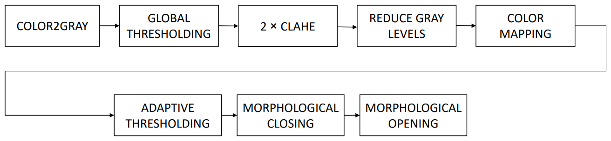

# NIR Vein Finder

## Overview

This repository contains the code and resources for a Near-Infrared (NIR) Vein Finder, a device designed to help medical professionals locate veins accurately for blood sampling, serum injection, and ampoule injection. The vein finder is based on near-infrared photography, which leverages the significant permeability of infrared light in tissues and its absorption by blood hemoglobin to determine the exact location of veins.

## Vein Finder Algorithm

The vein finder algorithm implemented in this GitHub repository uses image processing techniques to detect and enhance the visibility of veins in captured frames. Here's how the algorithm works:



1. Conversion: The algorithm converts the input frame into a black and white image.
2. Vein Mask: A mask is created using the thresholding algorithm to isolate the veins in the image.
3. Contrast Enhancement: The algorithm employs the CLAHE (Contrast Limited Adaptive Histogram Equalization) algorithm to enhance the contrast of the image and make the location of the vessels clearer.
4. Leveled Image: The resulting image is a leveled image that combines the input black and white image with the CLAHE-processed image.
5. Noise Removal: Adaptive thresholding and morphological algorithms are used to remove noise caused by hand hair, improving the accuracy of the vein detection process.

The final output provides an enhanced visualization of the veins, making them more distinguishable and aiding in the identification process.

## Hardware Requirements

To build and use the NIR Vein Finder, you will need the following hardware:

- Raspberry Pi (preferably Model 3 B+ or a more capable device)
- OmniVision 5647OV camera sensor (without an infrared filter)
- 850 nm LEDs
- Infrared pass filter with a central wavelength of 850 nm
- Optional: CCD camera with a Sony 274ICX sensor (for higher quality NIR images)

## Usage

To use the NIR Vein Finder, follow these steps:

1. Clone this repository to your Raspberry Pi.
2. Make the `main.py` file executable by running the following command in your terminal:
   ```
   chmod +x main.py
   ```
3. Run the program by executing the `main.py` file. You can do this by either double-clicking on the file or running the following command in your terminal:
   ```
   ./main.py
   ```
4. The program will execute, and the image will be displayed to the user.

## Limitations

- The resolution of the obtained images may be lower than commercial detectors due to the use of a non-specialized camera sensor.
- The output frame rate of the detector may be limited by the Raspberry Pi processor's ability to process the images at a suitable frame rate.

## License

This project is licensed under the MIT License. See the `LICENSE` file for details.
